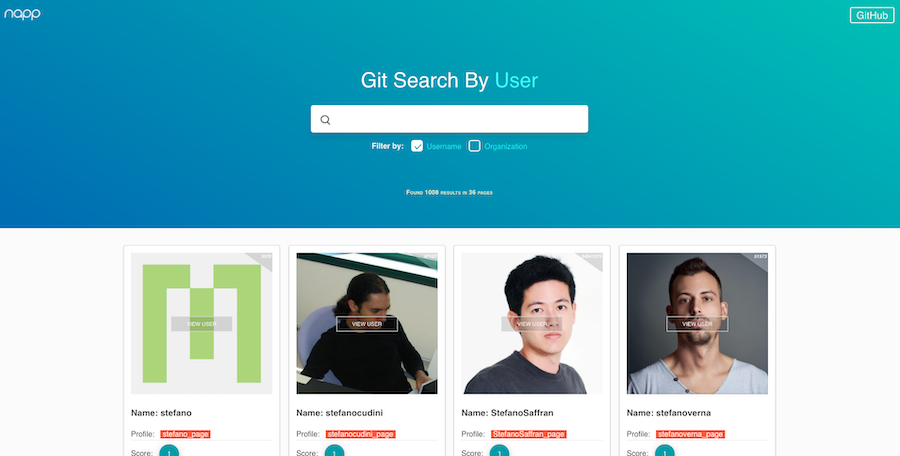
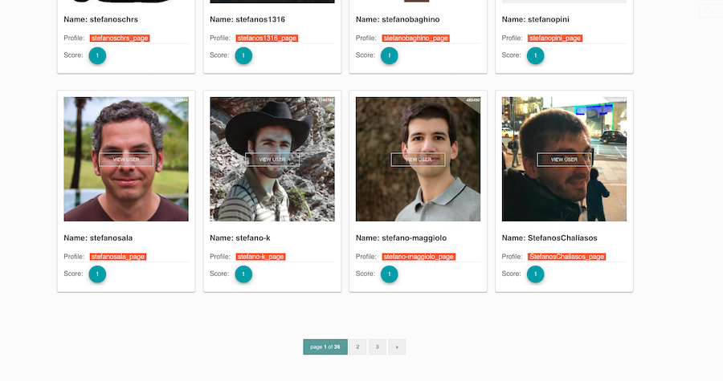
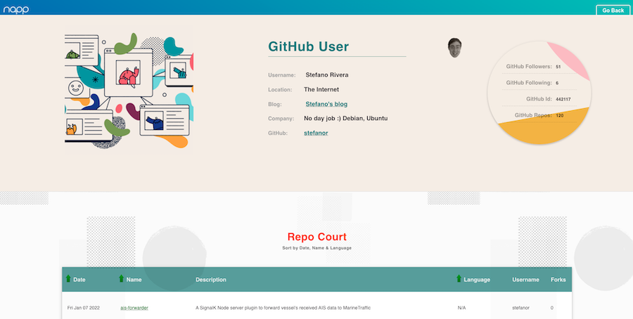

 &nbsp;  &nbsp;  &nbsp; 

 

<h2 align="center">NAPP Github API - Search repositories by User/Organization</h2>

 

> bootstrapped with `Create-react-app`

### To install
- clone repository
- `npm install` dependencies
- `npm start`
- open browser http://localhost:3000

 

<kbd>Screenshots</kbd>
 

<kbd>1</kbd>

 
<kbd>2</kbd>

 
<kbd>3</kbd>

:100:
