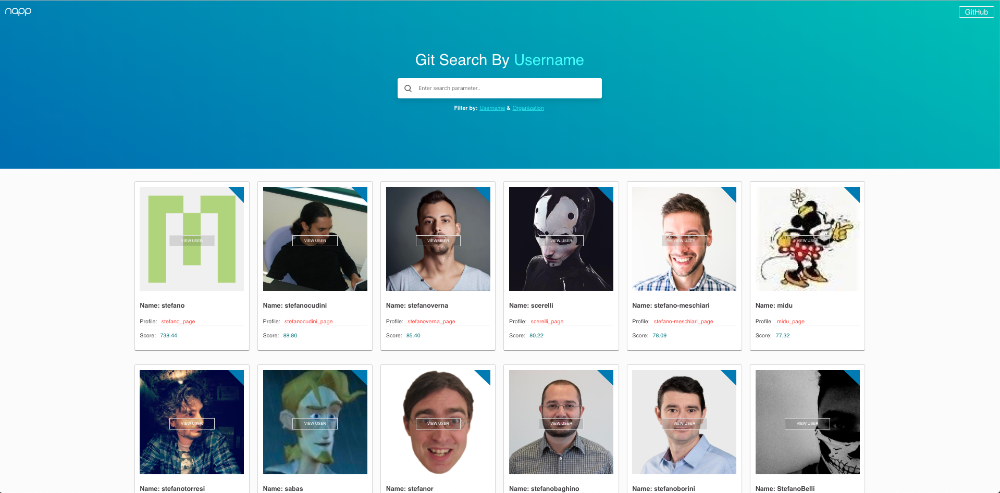
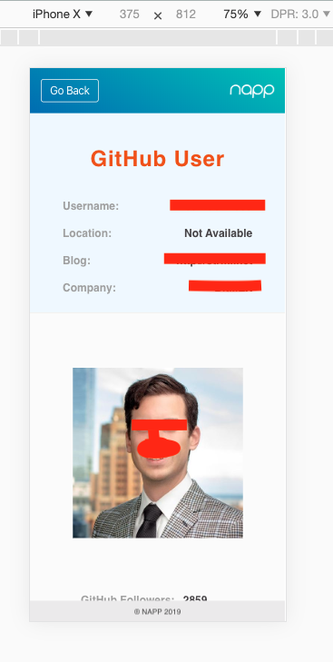

## NAPP &nbsp; &nbsp; :violin:

> bootstrapped with `Create-react-app`

### To install
- `npm install` dependencies
- `npm start`
- open browser http://localhost:3000

 

`sketching out layout`

:100:

#### ttdo

- details page header top nav scrolling
- refactoring
- pagination (console)
- nav links
- filters/sorting
- anim
- etc etc...

<removed-token>
